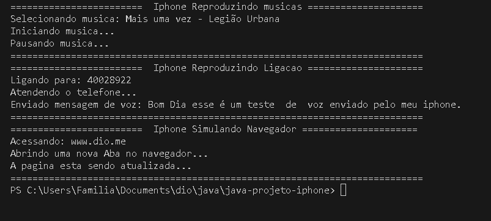

# DIO - Trilha Java Básico

### POO - Desafio

Modelagem e diagramação da representação em UML e Código no que se refere ao componente iPhone.

Com base no vídeo de lançamento do iPhone conforme link abaixo, elabore em uma ferramenta de UML de sua preferência a diagramação das classes e interfaces com a proposta de representar os papéis do iPhone de: Reprodutor Musicial, Aparelho Telefônico e Navegador na Internet. Em seguida crie as classes e interfaces no formato de arquivos .java

Lançamento iPhone 2007

    Minutos relevantes do 00:15 até 00:55

Comportamentos esperados:

    Repodutor Musicial: tocar, pausar, selecionarMusica
    Aparelho Telefônico: ligar, atender, iniciarCorrerioVoz
    Navegador na Internet: exibirPagina, adicionarNovaAba, atualizarPagina


## 

### IDE Utilizada 
- VSCODE: Editor de codigo-fonte desenvolvido pela Microsoft

## Interfaces

Para a criação desse App, foram criados 3 interfaces que posteriormente na classe Iphone foram implementadas. Essas interfaces são:

- AparelhoTelefonico.java
- NavegadorInternet.java
- ReprodutorMusical.java


## Diagrama UML do Projeto

Abaixo se encontra a modelagem que foi utilizada para a criação do APP Iphone. Esse diagrama foi criado na ferramenta [draw.io](draw.io).


## Exemplo de Aplicaçao

Segue o codigo fonte abaixo de um teste da aplicação e seu resultado:

````
public class App {
    public static void main(String[] args) throws Exception {
        Iphone iphone = new Iphone();
        System.out.println("========================  Iphone Reproduzindo musicas =====================");
        iphone.selecionarMusica("Mais uma vez - Legião Urbana"); //Só adicionar o nome da musica no parametro.
        iphone.tocar();
        iphone.pausar();
        System.out.println("===========================================================================");

        System.out.println("========================  Iphone Reproduzindo Ligacao =====================");
        iphone.ligar(40028922); // inserir numeros para realizar a ligação, porem nao pode ser do tipo texto, nesse casso inserir sem as "".
        iphone.atender();
        iphone.iniciarCorreio("Bom Dia esse é um teste  de  voz enviado pelo meu iphone."); // inserir a mensagem de texto simulando audio.
        System.out.println("===========================================================================");
        
        System.out.println("========================  Iphone Simulando Navegador =====================");
        iphone.exibirPagina("www.dio.me"); // Inserir um site para aparecer na aplicação.
        iphone.adicionarAba();
        iphone.atualizarPagina();
        System.out.println("===========================================================================");

    }
}
````

#### Resultado:



##
<div align="center"> Feito por <a href="https://github.com/felipertec">Felipe 🧑‍💻</a>
